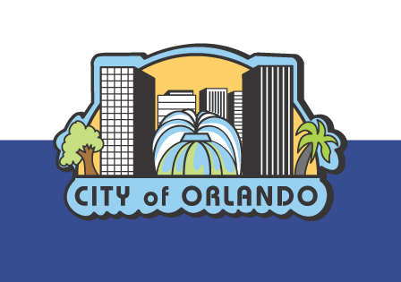
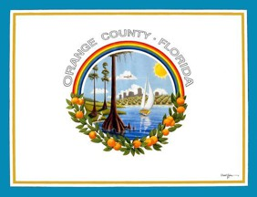
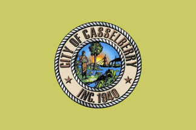
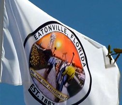
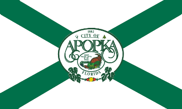
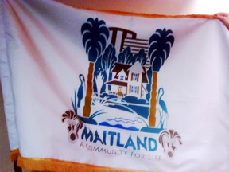
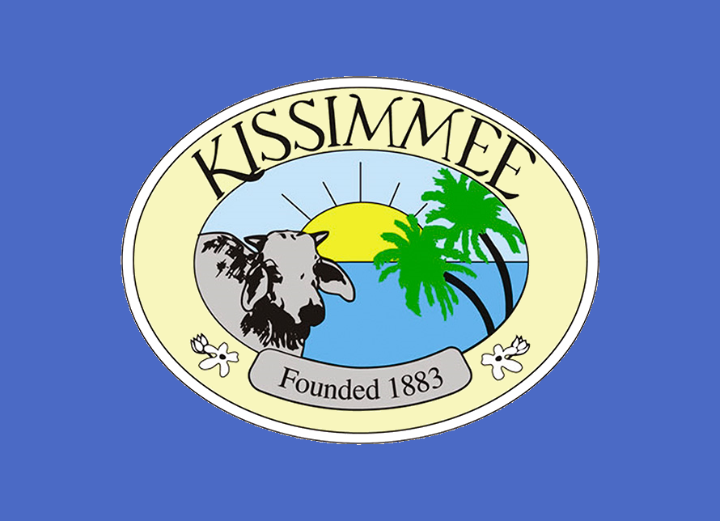
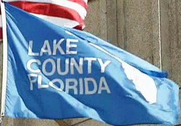
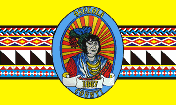

Prior "Art"
===========

* 2005-10, [San Francisco citizens want a new flag](http://www.sanfranciscoflag.com/)
http://www.gabere.com/Albuquerque-Flag-Redesign
* 2013-10, [Bressler Group redesigned Philadelphia's flag](http://accelerator.bresslergroup.com/2013/10/sideproject-reflag-for-designphiladelphia/)
* 2013-08, [Bressler Group proposed new state (and District) flags](http://accelerator.bresslergroup.com/2013/08/united-we-stand/)
* 2014-06, [Provo Mayor embarassed enough to call for replacement](http://blog.cvsflags.com/flag-fun/provo-mayor-calls-citizen-input-new-city-flag-redesign)
* 2015-05, [Albuquerque resident designs new flag](http://www.gabere.com/Albuquerque-Flag-Redesign)
* 2015-05, [El Paso redesign](http://jamesreyes.tumblr.com/post/120409320491/a-proposed-redesign-of-the-flag-of-the-city-of-el)
* 2015-06, [Boston Globe even makes a worksheet for readers to use to redesign Boston's flag](https://www.bostonglobe.com/ideas/2015/06/13/improving-boston-city-flag/pSGLpo3Ef1jNiK4Ejtk8oL/story.html)

What we have around us now
--------------------------

----

From the [North American Vexillological Association book "Good Flag, Bad Flag"](http://www.ausflag.com.au/assets/images/Good-Flag-Bad-Flag.pdf),

The Five Basic Principles of Flag Design
========================================

1. *Keep it Simple.*  The flag should be so simple that a child can draw it from memory
2. *Use Meaningful Symbolism.* The flag’s images, colors, or patterns should relate to what it symbolizes 
3. *Use 2 to 3 basic colors.* Limit the number of colors on the flag to three, which contrast well and come from the standard color set 
4. *No Lettering or Seals.* Never use writing of any kind or an organization’s seal
5. *Be Distinctive or Be Related.* Avoid duplicating other flags, but use similarities to show connections

Keep it Simple
--------------

Flags flap. Flags drape. Flags must be seen from a
distance and from their opposite side. Under these
circumstances, only simple designs make effective
flags. Furthermore, complicated flags cost more to make,
which often can limit how widely they are used.

Most poor designs have the elements of a great
flag in them—simplify them by focusing on a single
symbol, a few colors, large shapes, and no lettering.

Avoid the temptation to include a symbol for everybody.
Ideally the design will be reversible or at least
recognizable from either side. Don’t put a different
design on the back. 

Use Meaningful Symbolism
------------------------

Symbolism can be in the form of the “charge”
or main graphic element, in the colors used, or
sometimes even in the shapes or layout of the
parts of the flag.

Usually a single primary symbol is best—avoid
those that are less likely to be representative or unique.
Colors often carry meanings: red for blood or sacrifice,
white for purity, blue for water or sky.

Diagonal stripes are often used by former colonies
as an alternative to the generally horizontal and vertical
stripes of European countries.

Use 2 to 3 Basic Colors
-----------------------

The basic flag colors are red, blue, green, black,
yellow, and white. They can range from dark to
light. Occasionally other colors are also used, such
as purple, gray, and orange, but they are seldom needed
in a good design.

Separate dark colors with a light color, and light
colors with a dark color, to help them create effective
contrast. A good flag should also reproduce well in
“grayscale”, that is, in black and white shades.

More than four colors are hard to distinguish and
make the flag unnecessarily complicated and expensive.
Flag fabric comes in a relatively limited number of
colors—another reason to stick to the basics

No Lettering or Seals
---------------------

Words defeat the purpose: why not just write
“U.S.A.” on a flag? A flag is a graphic symbol.
Lettering is nearly impossible to read from a
distance, hard to sew, and difficult to reduce to lapel–pin
size. Words are not reversible—this forces double– or
triple–thickness fabric.

Don’t confuse a flag with a banner, such as what is
carried in front of a marching band in a parade, or draped
behind a speaker’s platform—such banners don’t flap,
they are seen from only one side, and they’re usually
seen closer–up.

Seals were designed for placement on paper to be
read at close range. Very few are effective on flags—too
detailed. Better to use some element from the seal as a
symbol. Some logos work; most don’t.

Be Distinctive or Be Related
----------------------------

This is perhaps the most difficult principle, but it
is very important. Sometimes the good designs
are already “taken”. However, a flag’s symbols,
colors, and shapes *can* recall other flags—a powerful
way to show heritage, solidarity, or connectedness. This
requires knowledge of other flags.

Often the best way to start the design process
can be looking to one’s “roots” in flags­—by country, tribe,
or religion. Use some of the many resources available
to help you with flag identification and history, such as
“Flags of the World”: http://www.fotw.net, or your local
library

Other Considerations
--------------------

A rectangle is the standard flag shape. Keep the
width–to–length proportions between 2:3 and 1:2.
Canadian flags are usually 1:2; U.S. flags are usually
2:3 or 3:5. Square flags are unusual in North America.
Abandon such rectangles only when meaningful.

Flags wear. By retaining a rectangular shape and
avoiding symbols at the fly end, a flag can be hemmed
repeatedly and given a longer life.

The point of honor is the “canton” area—the upper–
left corner. This corresponds to the part of the flag that is
seen when it hangs limp from a flagpole. The center or
left–of–center position is the most visible spot for a
symbol when the flag is flying.

Consider the fabrication methods. Curved lines add
to the cost of sewn flags. Holes or “negative space” hurt
a flag’s fly–ability and wear–ability. “Swallow–tail” shapes
fray more easily.

All rules have exceptions. Colorado’s “C” is a
stunning graphic element. Maryland’s complicated
heraldic quarters produce a memorable and distinctive
flag. But depart from these five principles only with
caution and purpose.

Don’t allow a committee to design a flag. Instead,
empower individuals to design flags, and use a committee
to select among them.

An old rule of heraldry has images of animals look
toward the hoist.

And most of all, design a flag that looks
attractive and balanced to the viewer and to the place,
organization, or person it represents!
